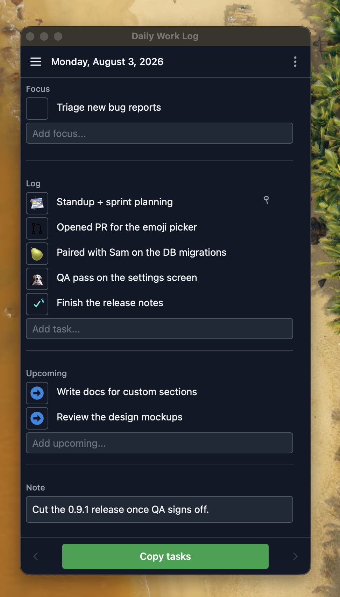

# Daily Work Log

A tiny desktop app for keeping a running log of what you work on each day — and turning it into a Slack-ready status update in one click.

Built with [Tauri](https://tauri.app), [SvelteKit](https://svelte.dev/docs/kit), and TypeScript. Your data lives in a local SQLite database on your machine; nothing is sent anywhere.

<p align="center">
  
</p>

## What it does

Each day is organized into a few simple lists:

- **Focus** — what you intend to get done today. Check an item off and it drops into the Log as completed.
- **Log** — what you actually did, each line tagged with a Slack emoji.
- **Upcoming** — what's next; carries over to seed the following day.
- **Custom sections** — add your own lists (e.g. "Blockers", "Meetings").
- **Note** — a free-form scratch area for the day.

When you're ready to post, **Copy tasks** formats everything with the right `:emoji:` prefixes and copies it to your clipboard, ready to paste into Slack.

## Features

- **Emoji rules** — auto-assign a Slack emoji to an entry when its text matches a pattern (a plain substring or a `/regex/`). Reorder rules to set match priority, and pick defaults for upcoming and completed items.
- **Pinning** — pin recurring items so they carry forward to the next day.
- **Day carry-over** — unfinished focus and upcoming items seed the next day automatically (configurable).
- **@mentions** — autocomplete teammates and drop them into your update.
- **History & weekly summary** — browse and search past days, and roll the Log up by week with a per-emoji count of everything you did.
- **Local & private** — everything is stored in a local SQLite database; no account, no sync, no network.
- **Lives in your tray** — closing the window keeps the app running in the menu bar / tray.

### Weekly summary → measurables

The **Weekly summary** view groups every day's Log by week and counts how many entries carried each labeled emoji, next to the week's total. Because emoji are auto-assigned by your rules (`:pr:`, `:review:`, `:qa:`, `:pair:`, …), those counts become ready-made weekly data points — how many PRs you opened, reviews you gave, QA passes you ran — with no extra bookkeeping.

That maps directly onto an [EOS](https://www.eosworldwide.com/) Scorecard: each labeled emoji is a weekly measurable, and the summary hands you the number to drop into your Level 10 meeting. Any emoji you don't want counted can be excluded from the summary in settings.

[Download Latest Version Here](https://github.com/knownasilya/daily-work-log/releases/latest)

## Development

Requires [Node.js](https://nodejs.org) with [pnpm](https://pnpm.io), plus the [Rust toolchain](https://www.rust-lang.org/tools/install) for Tauri.

```bash
pnpm install
pnpm tauri dev      # build and run the desktop app
```

Other useful scripts:

```bash
pnpm dev            # run just the SvelteKit frontend in a browser
pnpm check          # type-check Svelte + TypeScript
pnpm tauri build    # produce a distributable app bundle
```

### Recommended IDE setup

[VS Code](https://code.visualstudio.com/) + [Svelte](https://marketplace.visualstudio.com/items?itemName=svelte.svelte-vscode) + [Tauri](https://marketplace.visualstudio.com/items?itemName=tauri-apps.tauri-vscode) + [rust-analyzer](https://marketplace.visualstudio.com/items?itemName=rust-lang.rust-analyzer).

## Building an unsigned macOS app

The macOS build is unsigned, so after building you need to clear the quarantine attribute before you can open it:

```bash
xattr -cr "/Applications/Daily Work Log.app"
```
